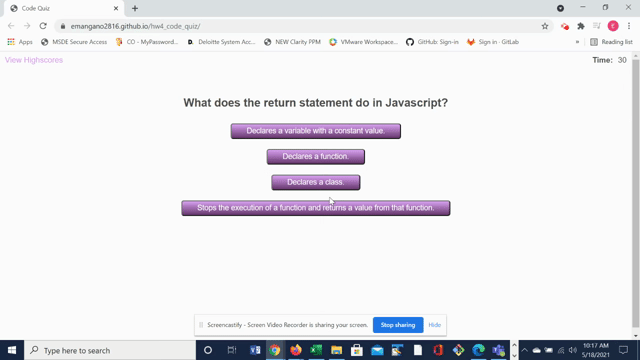

# Homework Assignment 4: Code Quiz

## URLs
1. Deployed application: https://emangano2816.github.io/hw4_code_quiz/
2. GitHub Repository: https://github.com/emangano2816/hw4_code_quiz

## User Story
```
AS A coding boot camp student
I WANT to take a timed quiz on JavaScript fundamentals that stores high scores
SO THAT I can gauge my progress compared to my peers
```
## Acceptance Criteria
```
GIVEN I am taking a code quiz
WHEN I click the start button
THEN a timer starts and I am presented with a question
WHEN I answer a question
THEN I am presented with another question
WHEN I answer a question incorrectly
THEN time is subtracted from the clock
WHEN all questions are answered or the timer reaches 0
THEN the game is over
WHEN the game is over
THEN I can save my initials and my score
```
## Achieving Acceptance Criteria
1. The "home" page of the application explains the rules of the game and presents the user with a 'Start Quiz' button.  When the button is clicked a 30 second timer begins and the user is presented with the first question.
2. The user answers the questions by clicking on the answer buttons for the question.  Upon clicking on an aswer the user will be presented with additional questions.
3.  If the user answers the question incorrectly, 10 seconds is deducted from the timer.  If the user answers the question correctly, the user scores 5 points.
4.  If the user answers all 10 questions or the time runs out, the game is over.  
5.  Upon answering all 10 questions or if the time runs out, the user is redirected to the 'All Done!'/'Time's Up!' page, where the user is asked to provide initials in order to store the score.

## Meeting Application Quality
The application is easy to navigate and uses pop-ups to guide the user in decision making.  When the URL is accessed the "start page" of the application is displayed.  From the start page the user is able to view highscores or start the quiz.  Once the quiz is started the user is able to click the 'View Highscores' link, however, if that happens while time is running for the quiz, a pop-up will appear letting the user know they are about to exit the game and will not be able to save their score.  

As the user answers each question, the result (i.e, correct or incorrect) is displayed under the subsequent question until one of the buttons for the current question is moused over.  At that point the result of the previous question will disappear.  Once all questions have been answered or the time runs out, the user is redirected to the 'All Done!/Time's Up!' page, respectively.  If the user tries to leave the page without providing initials or provides invalid initials (i.e., a null, a value with numerics, or a value that is not at least one and no more than three alphas) pop-ups appear to alert the user and assist with fixing the problem.  Once initials are supplied, the user is redirected to the Highscores page.  This page displays the user's initials - score for all played rounds.  On the Highscores page the user is able to return to the start page to take the quiz again or clear out the saved high scores.

## Application Functionality



